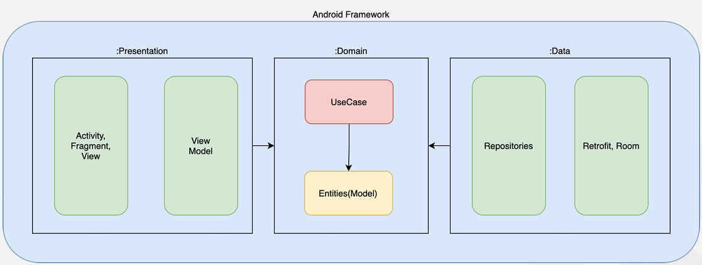

# DI-Hilt-Multi-Module

## 의존성이란
어떤 대상이 참조하는 객체 또는 함수

ex:)
자동차를 예시로 들 때 자동차는 엔진이 없이는 구성될 수 없음 => 코드적으로는 Engine을 import 하지 않거나 초기화 하지 않고서는 차가 compile 되지 않음

이를 자동차는 엔진에 의존한다라고 함 또한 엔진을 의존성이라고 함

+ ### 의존성 주입
    대상 객체에 의존성을 제공하는 기술

    ex:) 아까 예시를 기준으로 Car는 엔진을 생성하는 책임을 가짐

    만약 엔진을 생성자의 매개변수로 받는다면, 자동차는 엔진 생성의 책임이 없어짐

    이러한 설계 패턴을 IoC (Inversion of Control, 제어 역전)이라고 함

    + #### IoC
        객체 생성의 책임을 내부에서 외부로 뒤집으면서 엔진에 대한 제어를 역전시키는 것
    
    + #### 장점
        + ##### 외부에서 생성된 것을 받기 때문에, Car 자체에 대해서 수정 없이도 여러 엔진을 받아서 처리할 수 있음
            => 수정 없이 다양하게 사용할 수 있으므로 Car 클래스의 **재사용성이 좋아짐**

            => 엔진을 초기화 하지 않고 **외부에서 주입 받고 있기 때문에 클래스 간 결합도가 낮춰짐 ( 디커플링 )**

            => 필요한 것을 외부에서 주입받으므로 Car가 가지고 있던 길었던 소스코드, 책임이 줄어듦

        + ##### 테스트가 쉬워짐
            외부에서의 객체 주입을 통해서 테스트 해볼 수 있음
    
    + #### 장점 요약
        + ##### 결합도가 낮아짐
        + ##### 재사용성이 가능해짐
        + ##### 보일러플레이트 감소
        + ##### 테스트가 쉬움
        + ##### 의존성 관리가 용이함 (자원 공유)

    + #### 보일러플레이트란
        여러곳에서 재사용되며, 반복적으로 비슷한 형태를 띄는 코드를 의미

## Injector
의존성을 Client에게 제공하는 역할

만약 기존에 아래와 같은 코드가 있었을 때
```kotlin
fun main(Args:Array<String>){
    val engine = Injector().getEngine()
    val car = Car(engine)
}
```

직접 main에서 초기화 하지 않고, 아래와 같이 엔진을 생성하는 Injector를 만들어서 Injector를 통하여 생성된 Engine을 받아 건네주는 것이 이상적
```kotlin
// Engine을 만들어서 건네주는 역할을 위한 Injector
class Injector{
    fun getEngine(){
        return Engine()
    }
}

fun main(args:Array<String>){
    val engine = Injector().getEngine()
    val car = Car(engine)
}
```

엔진을 호출할 때마다 새로운 Engine을 초기화 해서 건네주지만, 만약 동일한 Engine을 공유하고 싶다면 Injector 내부에서 동일한 Instance를 참조할 수 있도록 코드를 작성해야 함

+ ### Injector의 또다른 명칭
    + Container
    + Assembler
    + Provider
    + Factory

## Flow란
Coroutine의 Flow는 Data Stream, Coroutine 상에서 반응형 프로그래밍을 지원하기 위한 구성요소

Coroutine에서 Data Stream을 지원하기 위해서는 Flow를 사용해야 함

기존의 명령형 프로그래밍에서는 Data의 소비자는 Data를 요청한 후 받은 결과값을 일회성으로 수신함

이러한 점은 Data가 필요할 떄마다 결과값을 매번 요청해야한다는 점에서 매우 비효율적

반응형에서는 Data의 Publisher와 Subscriber가 있고, Data의 발행자는 새로운 Data가 들어오면 소비자에게 지속적으로 발행하는 역할을 함

이것을 **Data Stream**이라고 함


+ ### 명령형 프로그래밍이란
    컴퓨터에게 무엇을 하라고 명령하는 것

    일반적으로 우리가 알고 있는 방식
    
    ex:)
    ```kotlin
    // 출력을 하라고 명령함
    println("count : 1")
    println("count : 2")
    println("count : 3")
    ```

+ ### 반응형 프로그래밍이란
    데이터가 변경될 때 Event를 발생시켜서 Data를 계속해서 전달하도록 하는 프로그래밍 방식

    Publisher와 Subscriber가 존재
    
    + #### Publisher
        발행자로, 자신을 구독하고 있는 구독자에게 값을 발행함
    
    + #### Subscriber
        발행자에게서 값이 오기를 구독하고서, 값이 왔을 때 Logic을 실행함

    + #### 예시
        ```kotlin
        fun main(){

            // publisher
            val publisher: PublisherSubject<String> = PublishSubject.create()

            // subscriber, 값이 왔을 때 출력하는 로직으로 설정
            publisher.subscribe{ it -> 
                println(it)
            }

            // publisher에서 값을 발행함 => subscriber는 값이 전달된 것을 파악하고, 이에 따른 자신의 로직을 실행함
            publisher.onNext("count : 1")
            publisher.onNext("count : 2")
            publisher.onNext("count : 3")

            // 결과
            count : 1
            count : 2
            count : 3
        }
        ```

        예전에는 setOnClickListener 등 사용자의 동작 Event에 따라 행동해야 하는 로직을 직접 명시해줘야 했지만,
        
        반응형으로 한다면 동작 Event에 따라 Publisher로 Data를 발행시키기만 하면, 해당 발행자에 대한 구독자의 동작만 신경쓰면 되기 때문에 관리할 것이 줄어듦

        => 구독자가 Publisher의 값에 따라 어떤 로직을 수행할지를 설정해놓으면 됨

        ```kotlin
        button1.setOnClickListener{
            publisher.onNext(BUTTON_CLICK_EVENT)
        }
        button2.setOnClickListener{
            publisher.onNext(BUTTON_CLICK_EVENT)
        }
        button3.setOnClickListener{
            publisher.onNext(BUTTON_CLICK_EVENT)
        }
        
        publisher.subscribe{
            if(it == BUTTON_CLICK_EVENT)
                doSomething()
        }
        ```
    
+ ### Data Stream 구조
    + ### Producer (생산자, Data 생성)
        Data를 발행하는 역할

        Flow에서 Producer는 **flow{} 블록 내부에서의 emit()을 통해 Data를 생성**

        ex:)
        ```kotlin
        class DustRemoteDataSource(
            private val dustApi: DustApi
        ){
            fun getDustInfoFlow() : Flow<List<DustInfo>> = flow{ // 1. Flow 블록 선언
                while(true){
                    val dustInfos = dustApi.fetchLastedDustInfo() // 2. 데이터 받아오기
                    emit(dustInfos) // 3. Producer가 Data 발행
                    delay(INTERVAL_REFRESH) // 4. 60초마다 반복
                }
            }
        }

        companion object {
            private const val INTERVAL_REFRESH: Long = 60000
        }
        ```
    + ### Intermediary (중간 연산자, Data 변환)
        생성된 Data를 수정하는 역할

        생성자가 A라는 객체로 이루어진 Data를 발행했는데, B라는 객체 Data가 필요할 경우, Flow에서 중간 연산자를 이용해 A 객첼르 B 객체로 변환할 수 있음

        **대표적으로 map(데이터 변형), filter(데이터 필터링), onEach(모든 데이터마다 연산 수행) 등의 중간 연산자가 있음**

        위 미세먼지 코드 예에서, 만약 우리 지역 데이터의 미세먼지 데이터만 필요하다면, map으로 데이터를 변형하면서, filter로 특정 지역의 Data만을 방출할 수 있음

        ```kotlin
        class DustRepository(
            private val dustRemoteDataSource: DustRemoteDataSource
        ){
            fun getDustsInfoOfViewItem(locale : Locale) = 
                dustRemoteDataSource.getDustInfoFlow().map{ it.filter{ this.locale == locale}}
        }
        ```

    + ### Consumer (소비자, Data 소비)
        **collect를 이용하여 전달된 Data를 소비할 수 있음**
        ```kotlin
        class DustViewModel(
            private val dustREpository: DustRepository
        ) : ViewModel(){
            fun collectDustInfoOf(locale: Locale) = 
                viewModelScope.launch{
                    dustRepository.getDustInfoOViewItemf(locale).collect { dustInfos ->
                        // 데이터가 들어왔을 때 실행할 로직
                    }
                }
        }
        ```
    
    + ### 요약
        DataSource에서 Data를 Publisher해서, Repository에서 Data를 수정하고, ViewModel에서 데이터를 소비


## Shared Preference와 Data Store
+ ### DataStore란
    Protocol Buffer를 사용하여 키-값 쌍 또는 유형이 지정된 객체를 저장할 수 있는 데이터 저장소

    Coroutine 및 Flow를 사용하여 비동기적이고 일관된 Transaction 방식으로 데이터를 저장하는 것이 특징

    기본적으로 Dispatcher.IO 밑에서 작동하며 Runtime Exception으로부터 안전

    Key-Value로 구성되어 있는 Preferences DataStore, 사용자가 정의한 데이터를 저장할 수 있는 Proto DataStroe가 존재

    Proto DataStore를 사용할 시 PRotocol Buffer라는 것을 이용해 Scheme를 정의해야 함

    => DataType을 보장해줄 뿐 아니라 SharedPreferences보다 빠르고 단순함

    DataStore는 Singleton 방식으로 하나의 객체로 관리해야 함

    + #### Protocol Buffer란?
        Data를 직렬화 하기 위한 메커니즘

    + #### 장점
        + Flow를 지원하며, Data에 변경이 발생해도 collect 하고 있다면 자동으로 Data를 전달받을 수 있음
        + 자동으로 Dispatcher.IO에서 작동하여 백그라운드에서 작업을 진행함
        + Flow의 catch 연산자를 통해 에러를 적절히 처리할 수 있음
        + 모든 작업이 하나의 Transaction 내에서 Atomic하게 발생하기 때문에 안전함
        + Proto Datastore 사용 시, type safe한 장점이 있어 RunTime Error 가능성 줄일 수 있음
        + 대용량의 데이터와 복잡한 데이터 구조를 보아 효율적으로 관리할 수 있음

    + #### 코드 예시
        ```kotlin
        // DataStore 생성
        val Context.dataStore: DataStore<Preferences> by preferencesDataStore(name = "이름")
    
        // DataStore 읽기
        // INT값의 value를 가져오는 Key 생성
        val EXAMPLE_COUNTER = intPreferencesKey("example")
        val exampleCounterFlow: Flow<Int> = context.dataStore.data
            .map { preferences ->
                // type-safe 하지 않음
                preferences[EXAMPLE_COUNTER] ?: 0
            }

        // DataStore 쓰기
        suspend fun incrementCounter(){
            // edit method를 사용하여 DataStore에 접근하고 key를 통해 값을 가져와 업데이트 함
            context.dataStore.edit{ settings ->
                val currentCounterValue = settings[EXAMPLE_COUNTER] ?: 0
                settings[EXAMPLE_COUNTER] = currentCounterVAlue + 1 // 마지막 라인에 변환 할 값 작성
            }
        }
        ```
    + #### Emit, Edit 차이
        + ##### Edit
            **DataStore의 값을 수정, 저장할 떄 사용**하는 것
            
        + ##### Emit
            **Flow에서 새로운 값 방출할 때 사용**하는 것


## Hilt
Android를 위한 표준적인 DI 솔루션을 제공

보일러플레이트 감소

Jetpack과 통함

테스트 도구 제공

마이그레이션 API 제공

+ ### 등장 배경
    기존 Android 언어는 JAVA였기 때문에 의존성 주입 또한 JAVA 방식을 따랐음
    
    (JSR 330, JAVA의 의존성 입을 위한 표준 방법을 정의한 내용)

    1. Guice
        + 자바를 위한 의존성 주입
        + Runtime에 의존성 주입
        + Reflection 기반

            RunTime에 Load된 다른 클래스 정보들을 가져올 수 있는 장점이 있지만, 비용이 큼 
            
            => Performance가 떨어지게 됨
    2. Dagger2
        + 자바를 위한 의존성 주입
        + 컴파일 타임 코드 생성
        + Square에서 최초 개발, 이후 구글에서 유지 보수
        + Reflection을 사용하지 않음
    3. Koin
        + Kotlin을 위한 의존성 주입
        + Reflection 사용
        + Serivce Locator Pattern
    4. Hilt
        + 2020년 6월 최초 출시
        + Android만을 위한 Solution
        + Dagger2 기반
        + 표준 컴포넌트 제공


+ ### Koin, Dagger2 비교

    |분류| Koin|Dagger1(Hilt)|
    |:---:|:---:|:---:|
    |**Runtime 안정성**|낮음|높음|
    |**Performance**|떨어짐|높음|
    |**의존성 관리 난이도**|어려움|쉬움|

    Koin은 의존성 체크를 Runtime에 실시 => Runtime에 Crash가 발생할 수도 있음

    Koin은 Reflection을 사용하기 때문에 Performance가 떨어짐

    Koin은 시간의 흐름에 따라 커졌을 때 의존성 그래프를 파악하기 어려움

+ ### Dagger2에 대해서
    + Annotation Processor로 자동 코드 생성

        Compile 타임에 오류를 Check 할 수 있고, Reflection을 사용할 필요 X
    + Running Curve가 높음

    + 높은 자유도

        => 동일한 문제를 해결할 때 개발자마다 서로 다른 방식으로 해결할 수가 있음

        => 혼란을 야기시킴

## Hilt 적용하기

+ ### @HiltAndroidApp

    Application class에 마킹해야 함


+ ### Binding (코드 X 개념 O)

    컴포넌트에 의존성을 추가하는 것


+ ### @AndroidEntryPoint
    Activity등 Android Component등에 마킹함

    마킹하면 ActvityRetainedComponent가 생성됨

+ ### @Inject
    두가지의 의미를 가짐

    변수 위에 선언할 때는 의존성 주입을 요청한다는 의미

    생성자 앞에 선언할 때는 해당 클래스의 의존성을 Component에 Binding 하겠다라는, 의존성을 추가하겠다라는 의미

+ ### 생성자를 통한 의존성 Binding 방법
    ```kotlin
    class App : Application(){
        
        // MyName 형식의 의존성을 주입해줄 것을 요청
        @Inject
        lateinit var myName: MyName

        override fun onCreate(){
            // super.onCreate()에서 의존성 주입이 이루어지므로, 그 이전에 의존성을 불러오려고 하면 error가 남
            super.onCreate()
            Log.e(TAG, "My name is $myName")
        }
    }

    // MyName이라는 의존성을 추가하겠다는 의미로 constructor 앞에 @Inject 추가
    class MyName @Inject constructor(){
        override fun toString(): String{
            return "예시"
        }
    }
    ```

+ ### Module을 통한 Binding 방법
    ```kotlin
    class App : Application(){
        
        // MyName 형식의 의존성을 주입해줄 것을 요청
        @Inject
        lateinit var myName: MyName

        override fun onCreate(){
            // super.onCreate()에서 의존성 주입이 이루어지므로, 그 이전에 의존성을 불러오려고 하면 error가 남
            // 꼭 이것뿐 아니라 Activity 등 Component에서 진입점(EntryPoint)를 설정하지 않아도 error가 남
            super.onCreate()
            Log.e(TAG, "My name is $myName")
        }
    }

    @Module
    @InstallIn(SingletonComponent::class)
    object AppModule{

        @Provides
        funj provideMyName():MyName{
            return MyName()
        }
    }

    // MyName이라는 의존성을 추가하겠다는 의미로 constructor 앞에 @Inject 추가
    class MyName {
        override fun toString(): String{
            return "예시"
        }
    }
    ```

> **super.onCreate()에서 의존성 주입이 이루어지므로, 그 이전에 의존성을 불러오려고 하면 error가 남**

> **또한 Component에 대해서 진입점을 설정해주지 않으면, super.onCreate() 이후에 변수를 호출을 해도 not initialize error 발생**

+ ### Annotation
    + #### Hilt Annotation 종류
        + ##### @HiltAndroidApp
        + ##### @AndroidEntryPoint
        + ##### @Module
        + ##### @InstallIn
        + ##### @HiltViewModel
    
    + #### Annotation Processor
        컴파일 타임에 어노테이션을 스캔하고, 소스 코드를 검사 또는 생성함

        Round : 어노테이션을 처리하는 과정

        소스 내의 모든 어노테이션이 처리될 때까지 몇차례의 라운드를 거치면서 어노테이션 프로세서가 코드를 스캔하고 처리함

    + #### Hilt Annotation 처리 요약
        + ##### Hild Annotatino을 사용하여 부가 정보를 제공
        + ##### Compile Time에 의존성 그래프에 이상이 없는지 확인
        + ##### 생성된 소스코드를 기반으로 동작하므로 Reflection을 사용하지 않아도 됨

+ ### Byte 코드 변조
    + #### Byte코드란?
        자바 소스코드가 컴파일을 거쳐 나온 결과물

    + #### Transform API
        AGP(Android Gradle Plugin)에 포함된 API

        중간 빌드 산출물들을 처리
        
        바이트 코드 변환을 위한 Gradle Task 생성

        AGP는 변조된 내용들 사이의 의존성을 Handling

    + #### Byte 코드 변조 이유
        Hilt 사용 시 필수는 아님

        소스 코드를 해치지 않으면서 Hilt를 사용할 때 편리하게 의존성 주입을 할 수 있도록 도와줌

        Hilt를 사용할 때 의존성 주입을 위해서 Hilt_~를 반드시 참조 해야 함

        => 이를 Annotation을 통해서 compile 과정 중에 변환 시켜줌


## 모듈이란
프로그램을 구성하는 구성요소

관련된 데이터와 함수를 하나로 묶은 단위

## Binding 주입 방법
Module Component에 Provides Annotation 사용

생성자에 Inject Annotation으로 Binding

## Inject

+ ### 사용 방법
    + #### 생성자 주입
        생성자 주입으로 의존성 주입을 받을 때 Parameter의 의존성도 주입 받지만, **주입 받는 대상도 Hilt Component에 Binding이 됨**
        ```kotlin
        // Bar라는 의존성을 Hilt Component에 요청하고 Runtime에 주입받음
        // 생성자의 Parameter로 주입받았기 때문에, Foo라는 객체를 Instance화 할 때부터 참조할 수 있는게 특징
        class Foo @Inject construct(bar: Bar){

        }
        ```
    + #### 필드 주입
        일반적으로 Android 클래스에서는 생성자 주입을 할 수가 없기 때문에, 필드 주입을 많이 활용

        필드 주입이나 메서드 주입의 경우에는 **@AndroidEntryPoint**라는 Annotation이 필수


        ```kotlin
        @AndroidEntryPoint
        class AndroidClass : {
            // 필드 주입의 경우 필드 위에 @Inject Annotation을 마킹하면 됨
            @Inject
            lateinit var bar:Bar
        }
        ```
    + #### 메서드 주입
        잘 활용되는 방식은 아님

        **필드 주입이 메서드 주입보다 먼저 수행됨**
        ```kotlin
        @AndroidEntryPoint
        class AndroidClass: {
            // 메서드 주입도 메서드 위에 @Inject Annotation을 마킹함
            @Inject
            fun setBar(bar: Bar){
                // ...
            }
        }
        ```


## 중복 Binding
Hilt는 기본적으로 package name을 포함한 type으로 의존성을 구분함

그런데 같은 의존성이 여러번 Component에 Binding 되었을 경우 Component 입장에서는 어떤 것을 Client(의존성을 요청하는 대상)에게 전달해야 할 지 애매모호해지므로 오류가 발생함


+ ### Qualifier
    간혹 의도적으로 중복 Binding을 쓰고 싶을 수 있음


    직접적으로 쓰는 것이 아님

    @Qualifier를 Annotation으로 갖는 새로운 Annotation을 정의해야 함

    ```kotlin
    // 새로운 Qualifier 정의
    @Qualifier
    annotation class CustomQualifier

    ------다른 영역-------

    @InsatallIn(SingletonComponent::class)
    object AppModule {

        // 새로운 Qualifier를 Binding하고자 하는 영역에 갖다 붙이면 됨
        @CustomQualifier
        @Provides
        fun provideFoo1(): Foo{
            return Foo()
        }

        @Provides
        fun provideFoo2(): Foo{
            return Foo()
        }
    }

    ------다른 영역------


    @AndroidEntryPoint
    class MainActivity: ComponentActivity(){
        
        // 의존성을 요청할 때도 Qualifer에 해당하는 의존성을 주입받고 싶다면, annotation을 붙혀서 요청하면 됨
        // 만약 @CustomQualifier를 붙이지 않는다면 @CustomQualifier 없이 선언한 provideFoo2 방식으로 의존성이 주입될 것
        @CustomQualifier
        @Inject
        lateinit var foo: Foo
    }
    ```
+ ### Named
   ```kotlin
   @InstallIn(SingletonComponent::class)
   object AppModule{
    // 문자열을 Unique한 Key값으로 갖는 Named Annotation을 선언해서 Component가 구분
    /// 만약 Client가 요청할 때 Name와 Key를 그대로 입력한다면 아래의 의존성으로 받을 수 있음
    @Named("Foo1")
    @Provides
    fun provideFoo1(): Foo{
        return Foo()
    }
   }
   ``` 
## Android Component별 의존성 주입 시기
|Component|Scope|Created at|Destroyed at|
|:--:|:--:|:--:|:--:|
|SingletonComponent|@Singleton|Application#onCreate()|Application Process is destroyed|
|ActivityRetainedComponent|@ActivityRetainedScoped|Activity#onCreate()|Activity#onDestroy()|
|ViewModelComponent|@ViewModelScoped|ViewModel created|ViewModel destroyed|
|ActivityComponent|@ActivityScoped|Activity#onCreate()|Activity#onDestroy()|
|FragmentComponent|@FragmentScoped|Fragment#onAttach()|Fragment#onDestroy()|
|ViewComponent|@ViewScoped|View#super()|View destroyed|
|ViewWithFragmentComponent|@ViewScoped|View#super()|View destroyed|
|ServiceComponent|@ServiceScoped|Service#onCreate()|Service#onDestroy()|
## Lazy
일반적인 주입과는 조금 다름

늦은 Instance 생성, Lazy Instance 주입 자체는 Component별 정해진 시기에 주입이 됨 하지만 Lazy 내부의 Generic Type은 주입이 되지 않은 상태

Generic Type을 가져오려면 Lazy의 get 메서드를 호출해야 함

**Lazy를 통해 Instance화 되는 시점을 늦출 수 있음**
**Lazy Instance는 매번 get() 호출에 동일한 Instance를 반환(같은 Lazy Instance에서의 호출에 대하여)**

```kotlin
@AndroidEntryPoint
class MainActivity : ComponentActivity() {
    @Inject
    lateinit var fooLazy:Lazy<Foo>

    override fun onCreate(savedInstanceState: Bundle?){
        super.onCreate(savedInstanceState)

        //get() 호출 시 Instance화
        val foo1 = fooLazy.get()
    }
}
```

+ ### Lazy 주입 특징
    + Lazy<T>의 get() 메서드를 호출할 떄 T를 반환함, get() 호출 시점에 T가 Instance화 됨
    + Lazy<T>의 get() 호출 이후 다시 get()을 호출하면 캐시 된 (동일한) T Insatnce를 얻음
    + T 바인딩에 Scoped가 지정되어 있다면, 각 Lazy<T> 요청에 대한 동일한 Lazy<T> Instance가 주입됨
    + **특정 시점에 바인딩 Instance화 할 때 사용하면 좋음**
    + **Instance 생성에 비용이 큰 경우 사용하면 좋음**


## Provider
주입받고자 하는 대상 의존성을 Generic으로 갖는 Mapper Provider를 주입받는 방식

**Provider는 매 get() 호출에 새로운 Instance를 반환**

```kotlin
@AndroidEntryPoint
class MainActivity : ComponentActivity() {
    @Inject
    lateinit var fooProvider:Provider<Foo>

    override fun onCreate(savedInstanceState: Bundle?){
        super.onCreate(savedInstanceState)

        //get() 호출 시 Instance화
        val foo1 = fooProvider.get()
    }
}
```

+ ### Provider 주입 특징

    + Provider<T>의 get() 메서드를 호출할 떄마다 새로운 Instance T를 반환함
    + T 바인딩에 Scope가 지정되어 있으면, Provider<T>의 get() 메서드를 호출할 동안 동일한 Instance T를 반환
    + T 바인딩에 Scope가 지정되어 있다면, 각 Provider<T> 요청에 대한 동일한 Provider<T> Instance가 주입됨
    + 하나의 Provider<T>로 여러 T Instance를 생성하기 원할 때 사용할 수 있음(Builder, Factory 패턴과 유사)


## Binding
+ ### 종류
    + ####  @Inject를 활용한 생성자 바인딩
        ```kotlin
        class Foo @Inject constructor()
        ```
    + #### @Provides를 활용한 바인딩
        Module 클래스에서 Provides Annotatino과 함께 메서드를 선언할 수 있음

        메서드의 ReturnType이 바인딩됨, **Null을 Return 하는 것을 허용하지 않음**
        ```kotlin
        @Module
        @InstallIn(...)
        object MyModule{
            // Client가 Foo 의존성을 요청할 때 Foo를 Binding 시키는 코드
            @Provides
            fun provideFOo(...): Foo{
                //...
            }
        }         
        ```
    + #### @Binds를 활용한 바인딩
        바인딩 된 의존성 효율적으로 활용하는 방법

        기존에 바인딩 된 의존성이 있다면 새로운 Provider 메소드를 만들지 않고 효율적으로 Binding 할 수 있는 방법


        ```kotlin
        interface Engine
        
        // Engine은 Binding 되지 않고 GasolineEngine만이 Binding됨
        class GasolineEngine @Inject constructor(): Engine

        => 만약 Client가 Engine 타입의 주입을 요청한다면 현재 Engine에 대해서 Binding된 것이 없으므로 Error가 발생함
        => GasolineEngine을 Engine으로 제공하는 Provides 메소드를 선언할 수도 있지만 @Binds를 쓰는게 더 좋음

        ```

        @Binds => 추상 클래스, 추상 함수로 선언
        ```kotlin
        @Module
        @InstallIn()
        abstract class EngineModule{
            @Binds
            abstract fun bindEngine(
                // Parameter로는 이미 바인딩 되었던 의존성을 명시해줌
                engine:GasolineEngine
                ): Engine
        }
        ```
        + ##### 제약 조건
            + **@Binds는 반드시 모듈 내의 abstract 메서드에 추가해야 함**
            + @Binds 메서드는 반드시 파라미터 1개만을 가짐
            + 파라미터 타입이 Return Type의 Sub Type 이어야 함
            + Scope 및 Qualifier Annotation과 함께 사용할 수 있음
        
        + ##### Concrete 클래스와 Abstract 클래스
            Concrete 클래스란 new로 Instance화 할 수 있는 Class

            Abstract는 abstract 키워드가 붙은, new를 통한 Instance화를 할 수 없는 클래스
        + ##### @Binds, @Provides와 함께 사용 시 주의해야 할 내용
            **@Binds는 Abstract Class의 Abstract 메소드에만 추가할 수 있는 반면, Provides는 Provides 메소드에 접근하고 호출하기 위해서 반드기 객체가 있어야 함**

            그렇기 때문에 반드시 Instance화 가능한 Concrete 클래스 내부에서 선언이 되어야 함 => Module 클래스가 Concrete 클래스여야 함

            But @Binds를 쓰게 되면 Module 클래스가 abstract로 선언이 됨

            그런 이유로 웬만하면 Binds와 Provides는 각각 독립된 Module에 존재하는 것이 좋음

            **만약 같이 쓰는 것이 필요하다면 Provides의 경우 companion object에 넣어서 굳이 Instance화 하지 않아도 접근할 수 있도록 설정**

            ```kotlin
            @Module
            @InstallIn(SingletonComponent::class)
            abstract class MyModule{
                companion object{
                    @Provides
                    fun provideFoo(): Foo{...}
                }

                @Binds
                abstract fun bindsEngine(engine:GasolineEngine):Engine
            }
            ``` 


    + #### @BindsOptionalOf를 활용한 바인딩
        바인딩 되어 있지 않을 가능성이 있는 의존성을 요청할 때 (= 옵셔널 바인딩)

        바인딩이 되어 있다면 상관 없지만 바인딩이 되어 있는지 불확실한 경우가 있음

        모듈에서 optional 하게 바인딩 해두고 Client에서도 Optional로 요청

        => Foo의 Binding 여부와 관계없이 Hilt의 Compile Validation을 Pass 할 수 있음

        ```kotlin
        // 모듈 클래스 내에서 @BindsOptionalOf를 추가, Binds와 마찬가지라 abstract임
        @Module
        @InstallIn(SingletonComponent::class)
        abstract class FooModule{
            @BindsOptionalOf
            abstract fun optionalFoo(): Foo
        }

        ----다른 영역----
        // 생성자 주입 방법
        @AndroidEntryPoint
        class MainActivity: ComponentActivity(){
            @Inject
            lateinit var optionalFoo: Optional<Foo>
        }

        class Bar @Inject constructor(
            optionalFoo: Optional<Foo>
        )

        or

        // Provides 주입 방법
        @Provides
        fun provideString(
            optionalFoo: Optional<Foo>
        ):String{
            // ...
        }

        // => 이렇게만 하면 Foo를 Binding으로 추가한 것은 없어서 Optional은 Binding되지만, Foo자체는 Binding되지 않음
        // => Foo 자체를 Binding 하는 코드도 작성해야 함

        object AppModule{
            @Provides
            fun provideFoo(): Foo{
                return Foo()
            }
        }
        ```

        + ##### Optional<T> 주요 메서드
            + ###### isPresent()

                Binding 된 경우 true를 반환

            + ###### get()

                바인딩 된 의존성 T를 반환함

                바인딩 되지 않은 경우 예외를 던짐

                orElse 류의 메서드 호출로 안전하게 접근할 수도 있음
        + ##### @BindsOptionalOf 제약 조건
            + @BindsOptionalOf는 반드시 모듈 내의 abstract 메서드에 추가해야 함
            + @BindsOptionalOf 메서드는 void 타입을 반환하면 안됨 (=반환 타입이 반드시 있어야 함)
            + **@BindsOptionalOf 메서드는 파라미터를 가질 수 없음** 
            
                Optional Binding은 지금 당장 어떤 의존성을 Binding 하겠다는 의도를 가지고 있는 것이 아님
            + 생성자 바인딩 된 의존성은 항상 present 상태이므로, 이 경우 해당 의존성은 Optional Binding이 불가함

                => 생성자 바인딩 해서는 안됨
            + Optional<Provider<T>>, Optional<Lazy<T>>, Optional<Provider<Lazy<T>>> 형태로도 주입 가능
        
    + ##### @BindsInstance를 활용한 바인딩
        **컴포넌트 생성과 동시에 바인딩**

        외부에서 생성된 의존성을 DI Graph에 바인딩하는 방법

        대거 사용자들은 직접 Component 설계 및 Instance를 생성해서 컴포넌트 생성 초기에 외부에서 생성된 Instance가 있다면 해당 Instance를 바로 Binding

        ```kotlin
        // @BindsInstance 예시
        @DefineComponent.Builder
        interface MyComponentBuilder{
            MyComponentBuilder setFoo(@BindsInstance Foo foo);
        }
        ```


## Multi Binding
여러 의존성을 하나의 컬렉션으로 관리

Collection 자체를 컴포넌트에 바인딩하는 기법

Hilt가 지원하는 Multi Binding의 Collection Type은 Set, Map 두가지

+ ### Set Multi Binding
    동일한 Type의 의존성들을 Set 형태로 관리하는 것

    + #### @IntoSet을 추가해서 사용
        ```kotlin
        // IntoSet을 쓰면 Compile 타임에 Component에 Set을 만들고, 그 Set에 Generic 타입인 의존성을 추가할 수 있는 환경을 만들어줌
        // IntoSet을 쓰면서 MultiBinding 할 것이라는 의도를 명시하여, 단독 Binding이 되지 않으므로 String을 요청하게 되면 Missing Binding Error가 발생
        @Module
        @InstallIn(SingletonComponent::class)
        class MyModuleA{
            @Provides
            @IntoSet
            fun provideOneString(): String{
                return "ABC"
            }
        }
        ```
    + #### @ElementsIntoSet을 추가해서 사용
        ```kotlin
        @Module
        @installIn(SingletonComponent::class)
        class MyModuleB{

            @Provides
            @ElementsIntoSet
            fun provideSomeStrings(): Set<String> {
                // 이런 식으로 한꺼번에 전달 
                // 위의 코드와 합쳐져서, Set<String>에는 "ABC", "DEF", "GHI"가 있음
                return listOf("DEF", "GHI").toSet()
            }
        }
        ```

        멀티 바인딩 된 Set 주입

        ```kotlin
        class Bar @Inject constructor(
            val strings: Set<String>
        ){
            init{
                assert(strings.contains("ABC"))
                assert(strings.contains("DEF"))
                assert(strings.contains("GHI"))
            }
        }
        ```
+ ### Map Multi Binding
    + #### 지원하는 기본 키
        + @StringKey
        + @IntKey
        + @LongKey
        + @ClassKey
    
    ```kotlin
    @Module
    @InstallIn(SingletonComponent::class)
    object MyModule{
        @Provides
        // @IntoMap으로 Map 바인딩 할 것임을 알려줌과 동시에 foo라는 StringKey를 쓸 것임을 명시
        @IntoMap @StringKey("foo")
        fun provideFooValue(): Long{
            return 100L
        }

        @Provides
        @IntoMap @ClassKey(Bar::class)
        fun provideBarValue(): String {
            return "value for Bar"
        }
    }

    ----다른 부분----
    //멀티 바인딩 된 Map 주입

    @AndroidEntryPoint
    class MainActivity: ComponentActivity(){
        @Inject
        lateinit var map1:Map<String, Long>
        @Inject
        lateinit var map2:Map<Class<*>, String>

        override fun onCreate(savedInstanceState: Bundle?){
            super.onCreate(savedInstanceState)
            map1["foo"].toString() // 100
            map2[Bar::class.java] // value for Bar
        }
    }
    ```

    + #### @MapKey를 이용한 Custom Key
        ```kotlin
        enum class MyEnum{
            ABC,
            DEF
        }

        // MyEnumKey라는 Custom Annotation을 생성해서 MyEnum을 받는 Custom Key 생성
        @MapKey
        annotation class MyEnumKey(val value: MyEnum)

        ----다른 영역----
        @Module
        @InstallIn(SingletonComponent::class)
        object MyModule{
            @Provides
            @IntoMap
            @MyEnumKey(MyEnum.ABC)
            fun provideABCValue(): String {
                return "value for ABC"
            }
        }
        ----다른 영역----
        class MainActivity : ComponentnActivity(){
            @Inject
            lateinit var map:Map<MyEnum, String>

            override fun onCreate(savedInstanceState: Bundle?){
                super.onCreate(savedInstanceState)
                map[MyEnum.ABC] // value for ABC
            }
        }
        ```

+ ### @MultiBinds
    기존의 IntoSet 등의 annotation은 꼭 의존성을 하나 이상 Binding 해야지만 생성됐음

    하지만 빈(Empty())인 경우가 필요할 수 있음

    그럴 때 MultiBinds Annotation을 사용할 수 있고 이를 통해 Compile 타임에 빈 Collection을 제공할 수 있음

    MultiBinding된 Collection이 존재하지 않는 경우에 Client에서 멀티 바인딩을 요구하면 Compile 타임에 해당 요소를 찾을 수 없으니까 Error가 발생할 수 있음

    그러나 MultiBiding을 쓴다면 에러 없이 작업할 수 있음 

    ```kotlin
    @Module
    @InstallIn(SingletonComponent::class)
    abstract class MyModuleA{
        @MultiBinds
        abstract fun fooSet(): Set<Foo>

        @MultiBinds
        abstract fun fooMap(): Map<String, Foo>
    }
    ```

    ## State란
    Android에서 ViewModel을 이용하는 궁극적인 이유는 상태를 유지하기 위함
    + ### 상태와 연관된 Android 특징
        + Activity/Fragment는 언제든지 파괴될 수 있음
        + Activity/Fragment가 파괴 되면 UI 상태가 유실됨
        + 새로운 데이터를 로드하는 비용이 큼
        + Activity/Fragment는 상태를 저장/복원하는 솔루션을 제공
        + 저장/복원 가능한 데이터의 사이즈는 한정적

    => 한정적이기 때문에 문제가 있었음

    => ViewModel을 사용하자

    + ### ViewModel
        비즈니스 로직 또는 UI 상태를 갖는 홀더

        MVVM의 VM과 용어가 같기 때문에 구분짓고자 AAC ViewModel이라고 부르기도 함

        **ViewModel 생성자를 불러서 사용하는 것은 일반 클래스를 만들어서 사용하는 것과 별반 다를 것이 없음**

        => ViewModelProvider라는 컴포넌트의 도움을 받아서 진행해야 함

        Kotlin에서는 delegates를 이용해서 by ViewModels()로 호출할 수 있음

        하지만 ViewModel 생성시 인자를 전달하기 위해서는 Factory를 제공해야 함

        + #### 매개변수가 있는 ViewModel 생성
        ```kotlin
        class FooViewModel(foo: Foo, handle:SavedStateHandle): ViewModel()

        val viewModel: FooViewModel by viewModels(
            factoryProducer = {
                // ViewModelProvider.Factory 반환
            }
        )


        class FooViewModelFactory(val foo: Foo): AbstractSavedStateViewModelFactory(){
            override fun <T: ViewModel> create(
                key: String,
                modelClass: Class<T>,
                handle: SavedStateHandle
            ): T{
                return FooViewModel(foo, handle) as T
            }
        }
        ```
        + #### ViewModel 사용 시 유의사항
            + ViewModel 주요 목적은 구성이 변경되어도 상태를 유지하는 것
            + 데이터를 영구 유지하려는 목적이면 로컬 디스크 또는 서버에 저장
            + Activity Context와 같은 객체를 참조하면 메모리 누수가 발생할 수 있음 => context를 참조하지 않는 것을 권장하나, 꼭 참조해야 한다면  Application Context를 참조해야 함
            + ViewModel은 UI에 대한 의존성이 없어야 함
            + ViewModel을 다른 클래스, 함수에 전달하면 안됨
    + ### Hilt ViewModel
        ```kotlin
        // ViewModel 클래스에 반드시 마킹되어 있어야 함 
        @HiltViewModel
        class FooViewModel @Inject constructor(
            val foo: Foo,
            val handle: SavedStateHandle,
        ): ViewModel()

        // 생성자가 필요한 ViewModel을 호출할 때도 Factory가 필요 없음
        @AndroidEntryPoint
        class MyActivity : AppCompatActivity(){
            private val viewModel: FooViewModel by viewModels()
        }
        ```
        
        ViewModelComponent에서 의존성을 공유하고 싶다면 @ViewModelScoped를 사용할 수 있음
        
        또한 ViewModelComponent 하위에서만 의존성을 제공하고 싶다면 @InstallIn Annotation 범위를 ViewModelComponent로 설정하면 됨

        ```kotlin
        @ViewModelScoped
        class Bar constructor @Inject(...)

        @Module
        @InstallIn(ViewModelComponent::class)
        object FooModule{
            @Provides
            fun provideFoo(bar:Bar): Foo{
                return Foo(bar)
            }
        }
        ```

## Entry Point
Hilt 의존성 주입이 어려운 코드에서 바인딩 된 의존성을 참조하는 방법

+ ### @AndroidEntryPoint와 @EntryPoint의 차이
    @AndroidEntryPoint Annotatino은 Activity, Fragment, Service 등 Android Componen Class에 사용된다면

    @EntryPoint는 Android Component Class 뿐 아니라 다른 Class에서도 Hilt Component에 접근할 수 있는 진입점을 제공

+ ### @EntryPoint 사용처
    + Hilt를 사용하지 않는 라이브러리에서 의존성 주입이 어려울 때
    + Hilt가 지원하지 않는 Android Component에 의존성 주입이 어려울 때
    + Dynamic Feature Module에 의존성 주입이 필요한 경우

**EntryPoint는 @EntryPoint와 @InstallIn으로 구성되며, 반드시 Interface로 선언되어야 함(그렇지 않으면 Component가 확장해서 구현을 할 수가 없기 때문)** 

**Interface 내에 선언되는 메서드는 반드시 정해진 포맷을 지켜서 선언되어야 함**

=> 프로비전 메서드로 만들어야 함

+ ### 프로비전 메서드란
    매개변수를 갖지 않으면서 반드시 반환 타입을 가지는 것

+ ### EntryPoint 만들기
    ```kotlin
    // Hilt가 Component를 생성할 때 FooEntryPoint를 확장함
    @EntryPoint
    // SingletonComponent에 바인딩 된 의존성만 접근 가능하게 됨
    @InstallIn(SingletonComponent::class)
    interface FooEntryPoint{
        fun getFoo(): Foo
    }
    ```

+ ### EntryPoint 접근하기
    ```kotlin
    // EntryPoints로 접근, 첫번째 인자는 HiltComponent 또는 application을 포함한 Android class
    // 두번째 인자는, EntryPoint Interface를 전달
    val fooEntryPoint: FooEntryPoint = EntryPoints.get(applicatoinContext, FooEntryPoint::class.java)
    val foo: Foo = fooEntryPoint.getFoo()

    // get으로 불러올 때 첫번째 인자의 Type은 Object이기 때문에 조금 더 명확하게 하고 싶다면
    // EntryPointAccessors를 이용해서 조금 더 Type Safe하게 EntryPoint에 접근할 수 있음
    val fooEntryPoint = EntryPointAccessors.fromApplication(context, FooEntryPoint::class.java)
    val foo: FOo = fooEntryPoint.getFoo()
    ```

    + #### EntryPointAccessors 메서드 종류
        + fromApplication
        + fromActivity
        + fromFragment
        + fromView

## Custom Component

사용자가 정의한 컴포넌트로 표준 컴포넌트 하위에 위치시킬 수 있음

반드시 Singleton Component 하위에 위치해야 하며 표준 Component들 사이에 배치시킬 수 없음
```kotlin
// @DefineComponent 어노테이션으로 상속받을 부모 Component class를 인수로 전달
@DefineComponent(parent = SingletonComponent::class)
// interface로 내가 생성할 Custom Component 생성
interface MyCustomComponent


// DefineComponent의 Instance가 여러 곳에서 참조가 될 때 DefineComponent 내부에 Builder가 위치하게 된다면
// 참초할 때마다 불필요하게 Builder까지 참조되면서 불필요한 코드가 생성될 수 있음
// 될 수 있으면 분리하는게 좋음 
// Custom Component Builder의 어노테이션
@DefineComponent.Builder
// Custom Component를 만들어주는 builder interface 생성
interface MyCustomComponentBuilder{
    // Builder를 만들 때는 엄격한 규칙을 지켜야 함

    // Parameter를 반드시 하나만 가지며 반환 타입은 선택에 따라 Component Builder가 될 수 있는 setter 메서드 필요
    fun setFoo(@BindsInstance foo: Foo): MyCustomComponentBuilder
    // Build 메서드는 Parameter를 가질 수 없으며, 반환 타입으로 반드시 Component를 가짐
    fun build(): MyCustomComponent
}
```

+ ### Custom Component Manager
    ```kotlin
    class CustomcomponentManager @Inject constructor(
        componentBuilder: MyCustomComponentBuilder
    ) : GeneratedComponentManager<MyCustomComponent> {
        lateinit var component: MyCustomComponent

        fun doSomething(foo: Foo){
            // ComponentBuilder를 주입 받아서 Component 생성
            component = componentBuilder.setFoo(foo).build()
            val bar = EntryPoints.get(component, MyCustomEntryPoint::class.java).getBar()
        }

        // 생성한 Component를 반환하면 됨 
        override fun generatedComponent(): MyCustomComponent = component
    } 
    ```

+ ### 단점
    + OverHead가 추가
    + Object Graph가 복잡해짐
    + Component는 하나의 부모 컴포넌트만 가짐
    + Custom Component는 표준화를 위반함
+ ### 주의사항
    + Component의 생명주기가 명확해야 함
    + Custom Component의 사용처가 명확하고, 범용적이어야 함
    + Hilt Component 대신 Dagger 컴포넌트 정의로 충분한지 고려
    + Custom Component는 직젖적이든 간접적이든 SingletonComponent의 하위에 위치해야 함
    + Component 계층 구조상, 표준 Component들 사이에 Custom Component를 위치시킬 순 없음


## Architecture
해당 SW를 구현한 사람들이 만들어낸 System의 형태

개발, 배포 및 운영 유지보수를 쉽게 할 수 있도록 도와줌

개발을 할 때 투입되는 비용을 최소화하는 것이 목적

Architecture는 코드가 엉망이 되어가는 것을 방지하는 규약이자 개발자들 간의 약속

## 객체지향 설계 원칙 SOLID
+ ### 단일 책임 원칙 - **S**ingle**R**esponsibility**P**rinciple
    하나의 클래스는 하나의 기능만 책임을 지는 것

    Employee 클래스에 비용 계산, 판매, app 개발을 모두 맡기는 것은 단일 책임 원칙이 위배되는 것

    => 회계사, 판매원, 개발자 클래스로 나누어서 업무를 분담하는 것이 좋음

    + #### 요약
        + 하나의 클래스는 하나의 기능만 책임지고 수행해야 함
        + SRP 원칙을 따를 시, 하나의 책임 변경이 다른 책임의 변경으로 전파되지 않음
        + 책임을 적절히 분배함으로써 코드 가독성이 좋아지고, 유지보수하기가 쉬워짐
        + 클래스 이름은 책임을 명확하게 드러낼 수 있도록 함
        + 낮은 결합도와 높은 응집도 고려해야 함

    + #### Dry 원칙
        Don't Repeat Yourself

        소스 코드를 복사해서 붙여넣는 경우가 있는데

        한 프로젝트 내에서 동일한 코드를 반복하지 말고 캡슐화해서 재사용화 하라는 것

+ ### 개방 폐쇄 원칙 - **O**pen**C**lose**P**rinciple
    기존의 코드를 변경하지 않고, 기능을 추가할 수 있도록 설계해야 함

    + #### 원칙
        + ##### 확장에 열려있다
            모듈의 확장성을 보장

            변경사항이 발생해도 쉽게 확장

            확장이라는 것은 새로운 기능이 추가되는 것

        + ##### 변경에 닫혀있다
            클래스를 수정하는 것을 제한

            객체지향의 다형성을 활용

        + ##### 요약
            + 기존의 코드를 변경하지 않으면서 기능을 추가할 수 있어야 함
            + 변경사항이 발생했을 때 손쉽게 코드를 추가하여 확장할 수 있음
            + OCP는 객체 지향 프로그래밍의 추상화를 의미함
            + abstract 또는 interface 키워드를 이용함
            + 의존 역전 원칙(DIP)의 설계 기반이 됨


        + ##### 원칙 위반 예제
            ```kotlin
            class Animal(val name: String)
            
            // Animal 이름마다 작성해야 함
            class AnimalSpeaker{
                when(animal.name){
                    "고양이" -> println("냐옹")
                    "개" -> println("멍멍")
                }
            }
            ```
            
            => 개선

            ```kotlin
            abstract class Animal(val name: String){
                abstract fun speak()
            }

            // Animal을 상속 받아서 각 클래스에서 speak 생성

            class Dog : Animal("개"){
                override fun speak() = println("멍멍")
            }
            class Lion : Animal("사자"){
                override fun speak() = println("어흥")
            }
            ```

+ ### 리스코프 치환 원칙 - **L**iskov **S**ubstitution **Principle
    자식 클래스는 부모 클래스로 대체 가능해야 함

    + #### 요약
        + 부모 클래스와 자식 클래스 사이의 행위가 일관성이 있어야 함
        + 부모 클래스 상속 시 정의한 원칙을 그대로 따라야 함
        + LSP는 협업 시 개발자 간의 약속을 지키는 원칙임
        + 객체 지향 프로그래밍의 다형성을 의미함
    
    ```kotlin
    abstract class Animal(val name: String){
        abstract fun speak()
    }

    class Dog : Animal("개"){
        override fun speak() = println("멍멍")
    }

    class Fish : Animal(){
        // 물고기는 울음 소리가 없어어 Animal의 speak 함수를 제대로 override 하지 못하므로, 자식인 Fish가 부모 클래스를 완전히 대체하지 못함
        // 하지만 물고기도 동물이 맞긴 함
        // => 추상화가 잘못되었다고 할  수 있음, 지금의 Animal은 울음 소리가 있는 동물을 기반으로 한 Class에 더 부합함
        override fun speak() = throw Exception("물고기는 울음 소리가 없어요")
    }
    ```

+ ### 인터페이스 분리 원칙 - **I**nterface **S**egregation **P**rinciple
    목적과 용도에 적합한 Interface 만을 제공함

    + #### 요약
        + Client의 목적과 용도에 적합한 Interface만을 제공
        + 유연하게 Class의 기능을 확장하거나 수정할 수 있음
        + SRP는 Class의 단일 책임을 갖오하고, ISP는 Interface의 단일 책임을 강조
        + Interface 분리는 변경사항을 예측하고 설계해야 하는데, 이는 개발자의 경험과 역량이 중요
+ ### 의존성 역전 원칙
    세부적인 내용을 갖고 있지 않은 추상화 된 상위 수준에 의존해야 함

    Caller는 Interface에 의존하고, 요청하는 시점에 구현체들이 Interface에 꽂혀서 구현됨

    => 구현체에 의존하지 않아도 됨

    + #### 요약
        + 대상을 참조할 때는 추상화 된 요소(Interface, abstract class)를 참조함
        + 추상화 된 요소를 구현한 내용이 저수준 클래스(모듈)이 됨
        + 고수준 클래스는 변경이 적고, 저수준 모듈은 변경이 잦음
        + 변경에 영향을 덜 받는 구조일 수록 재사용성, 확장성 및 유닛 테스트가 쉬워짐

    ```kotlin
    interface Engine
    class GasolineEngine: Engine
    class DieselEngine: Engine
    class Car(val engine: Engine)

    val engine = DieselEngine()
    // val engine = GasolineEngine()
    val car = Car(engine)
    ```

## 클린 아키텍쳐
SW 구조를 설계할 때 지켜야 할 원칙과 방법을 정의한 개념

내부로 이동할 수록 고수준 모듈로 추상화 수준이 높고, 바깥쪽으로 갈 수록 세부적인 구현 사항이 많아짐

안쪽에 있는 것들이 조금 더 높은 수준의 범용성을 가지게 됨

+ ### 요약
    + 클린 아키텍처에서 의존성 방향은 반드시 바깥쪽에서 안쪽으로 향해야 함
    + 동심원 안쪽으로 갈 수록 추상화 레벨이 높아짐 (고수준)
    + 계층을 횡단할 때는 의존성 역전 원칙을 기억하자

+ ### 고수준, 저수준 모듈
    + #### 저수준 모듈
        + 상세한 기능 구현
        + **변경이 잦을만한 요소의 집합**

        예) 문자열을 암호화한 뒤, 로컬 및 원격 데이터베이스에 저장함
    
    + #### 고수준 모듈
        + **핵심적인 비즈니스 로직**
        + 추상적으로 서술

        예) 문자열을 저장

+ ### 의존성 규칙
    의존성은 반드시 바깥에서 안쪽으로

    내부에서는 외부를 알 수 없어야 함

    외부의 것은 내부를 의존하기 때문에 알 수 있음

    **단 외부의 것으로 인해 내부를 변경시켜서는 안됨**

    ex) Entity에서는 UseCases 등 외부를 알 수 없어야 함 && UI 영역으로 인해 Entity가 변경되어서는 안됨 (메서드 파라미터가 변경된다던지 등)
    

+ ### 계층
    + #### Entity
        핵심적인 내용, 규칙, 행동, 로직 등을 캡슐화

        가장 핵심적이며 고수준임

        변경되지 않을만한 것들이 들어가야 함

        어떤 메서드를 갖는 객체일 수도 있고, 데이터 모델일 수도 있고, 함수의 집합일 수도 있음

        **가장 변하지 않을만한 것이라는 것이 핵심**

    + #### UseCase
        Application이 갖는 기능, Function, Business Logic 등을 SRP를 준수하고 캡슐화 하면서 구현하는 계층

        의존성 규칙에 따라서 UseCase 변경사항이 Entity에 영향을 주어선 안되며, DB나 UI, FrameWork등이 UseCase에 영향을 주어선 안됨

        SRP를 준수해서 하나의 기능만 수행하도록 하는 것이 일반적
        ex)App 내에서 사용자 목록을 가져오는 기능이 있다면 이를 캡슐화한 getUserList와 같은 UseCase 클래스를 만들 수 있을 것 하지만 구현 기능 없이 추상적으로 보통 구현함

        보통 get~UseCaseInterface or abstract Class로 만드는 것이 일반적

        단일 기능을 가지는 추상적인 Interface나 Class들이 포함됨

    + #### Interface Adapter
        일반적으론 UseCase에 선언된 추상화된 Interface나 abstract Class에 대한 상세한 구현을 Interface Adapter에서 함

        기본적으로 Clean Architecture는 각자의 계층에서 사용하기 가장 편리한 타입, 소위 우리가 말하는 Model이라는 것을 직접 따로따로 선언해서 사용

        UseCase의 계층에 선언된 내용을 상속 받아서 구현하게 되더라도 결국 UseCase를 호출하는 Parameter Type Return Type이 일반적으로 Entity 계층에 선언된 Model Type이기 때문에 어디서 가져왔더라도, Type에 맞춰서 넘겨줘야 함 => Entity 계층에 있는 Model로 변환을 해야 함

        즉 Intferface Adapter의 역할은 동심원 계층을 넘나들 때 그 계층이 가장 이해하기 쉬운 Type으로 변환하는 것이며 UseCase와 Entity, DB, UI에서의 Data 변환을 하게 되는 역할

        예를 들어 DB에 있는 Data를 UI에 표현하게 될 때 계층을 넘나들게 될텐데, 넘나들때마다 형변환을 해주어야 하고 이 역할을 Interface Adapter가 하게 됨

    + #### FrameWork 및 Driver
        Android에서는 Android FrameWork 및 Library를 포함한 모든 세부적인 내용


+ ### 계층을 횡단하기 - 제어 흐름
    바깥쪽에서는 안쪽을 알지만 안쪽에서는 바깥쪽을 모르기에 만약 서로 Communication이 필요하다면

    Interface로 의존성 역전을 시켜서 원하는 데이터나 이벤트를 안쪽으로 전달 가능

+ ### Google이 권장하는 App Architecture
  + #### UI Layer
    화면에 데이터를 표시하는 것
  + #### Domain Layer
    Business Logic을 캡슐화 하는 것
  + #### Data Layer
    네트워크나 로컬에서 데이터를 불러오는 것

  + #### Sequence 

    ```mermaid
    flowchart TB
    a(UI Layer) --> b(Domain Layer) --> C(Data Layer)
    ```

  + #### 요약
    + 두 아키텍쳐 모두 계층적인 구조를 갖고 있음(= 관심사 분리)
    + 앱 아키첵쳐에서는 UI가 Data를 의존하고, Clean 아키텍쳐에서는 의존 관계를 가지지 않음
    + Android 권장 App 아키텍쳐가 직관적이며 이해 쉬움
    + 클린 아키텍쳐는 대규모 시스템에 더 적합함
  + #### 클린 아키텍쳐와의 차이점
    **계층 간 의존성 방향**

    앱 아키텍쳐는 UI가 Data를 의존함

    하지만 Clean Architecture에서는 UI와 Data는 같은 레이어이고, 의존성은 안으로만 향함

    + ##### 이유
      + ###### 범용성
        각 서비스나 프로젝트, 부서별로 요구사항이 다를 수 있기 때문에, 그에 맞게 설계하는 것이 중요함

        여러 서비스에 맞으면서, 단점 없고 은총알 같은 완벽한 아키텍쳐는 존재하지 않음

        Google은 모든 Android 개발자를 상대로 알맞은 Architecture 설명을 하기 어려움

        => 범용적으로 아우를 수 있는 가이드를 제시해야 함 => 이해 쉽고 적용도 쉬운 아키텍쳐


      + ###### Clean Architecture를 배워야 하는 이유
        의존성 규칙 때문

        앱 아키텍쳐는 Data Layer에 의해 Domain과 UI 계층도 영향을 받음

        하지만 Clean Architecture는 UI와 Data가 완전히 분리되어 있음

        => 협업에 유리 및 외부 변화로부터 Entity나 Usecase가 변경되지 않는 강건한 구조를 가짐

        => 확장성, 유닛 테스트 및 용의성, 빌드 시간 단축 등 여러 면에서 구글의 앱 아키텍쳐보다 우위를 가지고 있음

        반드시 적용해야 하는 것은 아님

    + #### 시나리오
        

        + ##### View
            View가 ViewModel에 의존적임

            ViewModel이 가지고 있는 Data 목록을 Observing 하고 있다가 Data 변경이 발생하면 View를 갱신함
        + ##### ViewModel
            Data를 불러오고 갱신하기 위해서 UseCase를 호출
        + ##### UseCase
            Repository를 거쳐서 DataSource로부터 Data를 가져와서 반환
        + ##### Repository<Interface>
            UI와 Data간 의존 관계가 없어 Communication이 어려우므로
        + ##### Repository
        + ##### LocalDateSource
        + ##### RemoteDataSource
        + ##### Entity
             


+ ### 관심사 분리
    계층을 나누는 것을 SW 관점에서 관심사 분리라고 함

    코드의 변경사항이 생겼을 때 관심있는 부분만 보면 되고, 변경 사항의 전파를 막음(UI의 변경사항이 Data에도 영향을 끼친다던가)

## 모듈화
Android에서 경계를 구분하고 영역을 분리하는 대표적인 방법


+ ### Presenter
    UI에 연관된 로직, 클래스
    ex)View, Composable, ViewModel

+ ### Domain
    UseCase, Entity

    **Android 의존성이 없는 범용적인 핵심적인 로직만 모여야 함**

    => Kotlin Library로 만드는 것을 권장
+ ### Data
    Room, Preference 등 Data와 연관된 클래스


+ ### 의존성
  

    Presentation과 Data가 Domain에 의존하는 형태

    이로 인해 독립적으로 테스트하는게 가능해짐

    => 앱 아키텍쳐의 경우는 UI 테스트를 위해 Domain과 Data까지 모든 모듈을 포함해서 빌드 해야 하지만 클린 아키텍쳐에서는 선택적으로 빌드를 할 수 있음

+ ### 요약
  + 권장 앱 아키텍쳐와 클린 아키텍처의 가장 큰 차이점은 DI 방향
  + 권장 앱 아키텍처는 범용성을 갖고 클린 아키텍처는 대규모 시스템에 적합
  + 클린 아키텍처 도입을 위해 android 모듈화를 진행할 수 있음 예) :presentation, :domain, :data

## MVI
MVI는 MVVM과 완전 다른 것이 아니라 MVVM으로부터 심화된 것 

순수 함수를 지향함 

MVVM에서 View Model에 Model과 Intent가 존재하고, Intent에 따라 Model이 변화하는 식
+ ### 장점
  + 상태 관리가 쉬움
  + 단방향 데이터 흐름
  + 스레드 안정성 보장
  + 디버깅이 쉬움
  + 테스트가 쉬움
+ ### 단점
  + 배우기 어려움
  + 보일러 플레이트 코드가 많음
  + 파일 및 메모리 관리가 어려움

+ ### 순수 함수란
    함수의 입력만이 함수의 결과에 영향을 주어야 함
+ ### Model
    UI의 상태 (State)
+ ### View
    UI

    ex) View, Compose 등
+ ### Intent
    의도

    사용자의 액션 또는 이벤트

    **Android의 Intent X**

+ ### 흐름
    

+ ### State Reducer

    Reducer(Transformer) = (State, Event) -> State

    => 기존의 상태에 이벤트가 더해져 새로운 상태가 만들어짐
    

    MVI에서 Intent 호출에 따른 결과로 새로운 Model을 만들게 됨

    => View에 보여줄 새로운 상태를 만들어야 함

    <mark>**새로운 상태를 만드는 로직의 집합**</mark>

    + MVI에서 상태는 불변해야 함
    + 새로운 이벤트는 기존 상태와 함께 새로운 상태를 만듦
    + 상태 관리를 한 곳에서 할 수 있음

+ ### MVI 예제 코드
  ```kotlin
  sealed class Event{
    object Increment: Event()
    object Decrement: Event()
  }

  // MVI에서 Model에 해당하는 부분
  data class State(val counter: Int = 0)

  // View Model은 View에 참조할 수 없음
  class ViewModel{
    val state = MutableStateFlow(State())

    // Intent를 호출하는 Trigger 부분
    fun handleEvent(event: Event){
        when(event){
            is Increment -> state.update { it.copy(counter = it.counter + 1) }
            is Decrement -> state.update { it.copy(counter = it.counter - 1) }
        }
    }
  }
  ```


  ```kotlin
  class ViewModel{
    private val events = Channel<Event>()
    val state =  MutableStateFlow(State()) // 외부에서 상태 변경 가능

    init {
        events.receiveAsFlow().onEach(::updateSTate).launchIn(viewModelScope)
    }

    fun handleEvent(event: Event) {events.trySned(event)}

    private fun updateState(event:Event){
        when(event){
            is Increment -> state.update {it.copy(counter = it.counter + 1)}
            is Decrement -> state.update {it.copy(counter = it.counter - 1)}
        }
    }
  }
  ```

  ```kotlin
  class ViewModel{
    private val events = Channel<Event>()
    // runnigFold는 주어진 이벤트와 상태를 통해서 새로운 상태를 만들어내는 State Reducer
    val state = events.receiveAsFlow()
        .runningFold(State(), ::reduceState) // State Reducer
        .stateIn(viewModelScope, Eagerly, State())

    fun handleEvent(event: Event) {events.trySned(event)}

    private fun reduceState(currentState:State, event:Event): State{
        return when(event){
            is Increment -> currentState.copy(counter = currentState.counter + 1)
            is Decrement -> currentState.copy(counter = currentState.counter - 1)
        }
    }
  }
  ```
+ ### Side Effect
    함수가 함수의 외부 요소 또는 상태를 변경하는 것

    MVI에서는 Intent가 새로운 UI의 상태를 만들어서 View에 보여주는데 그렇게까지 할 필요가 없는 경우가 존재
    
    ex) 다이얼로그를 띄운다거나 등, 새로운 액티비티르 띄우거나, 토스트로 일시적인 메시지를 띄우는 것

    => 실제 화면의 상태와는 크게 중요하지 않은 기능을 처리할 때

    + 안드로이드에서 순수함수로만 앱을 구성하기는 어려움
    + 사이드 이펙트는 일반적으로 Navigation, Logging, 분석, Toast 등 일회성 이벤트를 처리할 때 필요
    + 사이트 이펙트 처리 결과는 선택적으로 UI 상태를 변경할 수 있음


## Kotlin
+ ### operator 키워드
  연산자를 오버로딩 할 수 있게 해주는 것
+ ### Sealed class
+ ### Enum class 